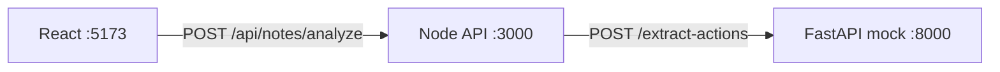

# Clinical Follow-Up Detector

A three-day portfolio project that analyzes **fictional** clinical text notes and extracts explicit treatment and follow-up actions into structured, reviewable tasks.

This is a demonstration system. It is not medically validated, not HIPAA compliant, and not intended for real patient data.

---

## Problem statement

Clinical notes often bury explicit follow-up instructions in unstructured prose. This application helps surface those instructions as structured actions that a human can review before acting on them.

---

## Implementation status

Be explicit about what exists today versus what is planned.

| Area | Day 1 (current) | Planned (Day 2+) |
|------|-----------------|------------------|
| React analyze UI | Paste/upload, analyze, loading/error/success, read-only action cards | Confirm, reject, edit, complete controls |
| Node API | `GET /health`, `POST /api/notes/analyze`, Zod validation, Python client, in-memory IDs | SQLite persistence, `GET /api/notes/:noteId`, `PATCH /api/actions/:actionId` |
| Python AI service | FastAPI with **deterministic rule-based mock** (no LLM) | External LLM provider via isolated client |
| SQLite database | **Not implemented** | Notes and actions persistence |
| Automated tests | **Not implemented** | Unit and integration tests per service |
| Production security | **Not implemented** | Authentication, audit logging, hardened deployment |

---

## Day 1 architecture (current)



- **React** sends note text to the Node API only.
- **Node** validates input, calls Python, maps `snake_case` → `camelCase`, and returns structured entities with generated IDs.
- **Python** runs a deterministic mock that pattern-matches CBC repeat instructions. No external LLM is called. No API key is required.

See [docs/architecture.md](docs/architecture.md) for the full Day 1 flow and the planned Day 2+ diagram.

---

## Planned architecture (Day 2+)

Not implemented yet:

- **FastAPI → external LLM** for real extraction across all action types
- **Node → SQLite** for durable notes, actions, and workflow state
- **Workflow endpoints and review UI** for confirm, reject, edit, and complete

These are defined in [docs/contracts.md](docs/contracts.md) but must not be assumed to work until implemented.

---

## Technology stack

| Layer | Technology |
|-------|------------|
| Frontend | React, TypeScript, Vite |
| Application API | Node.js, Express, TypeScript, Zod |
| AI service | Python, FastAPI, Pydantic |
| Database (planned) | SQLite |
| AI integration (planned) | One external LLM provider |

---

## Service responsibilities

| Service | Owns |
|---------|------|
| **React** (`apps/web`) | User input, client validation, presentation, loading and error states |
| **Node API** (`apps/api`) | Public HTTP API, request validation, Python communication, field mapping, workflow state (planned), persistence (planned) |
| **Python AI** (`apps/ai-service`) | Extraction logic, response validation, AI-specific errors |
| **SQLite (planned)** | Persisted notes, actions, review and completion state |

The browser must never communicate directly with an LLM provider.

---

## Prerequisites

**Day 1:**

- Node.js 18 or newer
- Python 3.11 or newer
- npm (bundled with Node.js)

**Not required on Day 1:**

- LLM API key
- SQLite
- Python environment variables

**Day 2+ (planned):** LLM provider credentials and database configuration. See the **Day 2+ / planned** section in [`.env.example`](.env.example).

---

## Environment variables

Root [`.env.example`](.env.example) documents all variables.

**Day 1 — Node API only** (optional; copy to `apps/api/.env`):

| Variable | Default | Purpose |
|----------|---------|---------|
| `PORT` | `3000` | Express listen port |
| `AI_SERVICE_URL` | `http://localhost:8000` | Python service base URL |
| `MAX_NOTE_LENGTH` | `20000` | Maximum note characters |
| `REFERENCE_DATE` | today's date | Deterministic relative-deadline resolution |
| `AI_SERVICE_TIMEOUT_MS` | `30000` | Python call timeout |

**Day 1 — Python AI:** no environment variables required.

**Day 1 — React:** no environment variables required (Vite proxies `/api` to port 3000).

---

## Running locally

Start services in this order:

### 1. Python AI service (port 8000)

```bash
cd apps/ai-service
python -m venv .venv
```

Activate the virtual environment, then:

```bash
pip install -r requirements.txt
python main.py
```

**Purpose:** Start the FastAPI deterministic mock.

**Success:** Server listens on `http://localhost:8000`. Verify with:

```bash
curl http://localhost:8000/health
```

Expected: `{"status":"ok","service":"ai-service"}`

### 2. Node API (port 3000)

```bash
cd apps/api
npm install
npm run dev
```

**Purpose:** Start the Express orchestration layer.

**Success:** Server listens on `http://localhost:3000`. Verify with:

```bash
curl http://localhost:3000/health
```

Expected: `{"status":"ok","service":"api"}`

### 3. React frontend (port 5173)

```bash
cd apps/web
npm install
npm run dev
```

**Purpose:** Start the Vite dev server with API proxy.

**Success:** Open `http://localhost:5173` in a browser.

---

## API endpoints

Contracts define the full API. Current implementation status:

| Endpoint | Status |
|----------|--------|
| `GET /health` (Node) | Implemented |
| `POST /api/notes/analyze` | Implemented (in-memory; not persisted) |
| `GET /api/notes/:noteId` | Planned |
| `PATCH /api/actions/:actionId` | Planned |
| `GET /health` (Python) | Implemented |
| `POST /extract-actions` (Python) | Implemented (deterministic mock) |

See [docs/contracts.md](docs/contracts.md) for request bodies, response shapes, enums, and error codes.

---

## Sample notes

Fictional notes in [`samples/`](samples/) support manual testing.

| File | Purpose | Day 1 mock result |
|------|---------|-------------------|
| `01-clear-test-deadline.txt` | Baseline CBC follow-up | One `test` action |
| `02-appointment-follow-up.txt` | Appointment extraction (future) | Empty list |
| `03-urgent-warning.txt` | Urgent warning (future) | Empty list |
| `04-ambiguous-deadline.txt` | Vague deadline / review flag (future) | Empty list |
| `05-no-follow-up-actions.txt` | No follow-up instructions | Empty list |

On Day 1, only sample `01` produces an action because the mock matches CBC + repeat + seven-day patterns. Other samples are for planned LLM extraction.

---

## LLM usage

**Day 1:** No LLM is used. Extraction is a deterministic Python mock.

**Planned (Day 2+):** The Python service will call one external LLM provider for information extraction only — not diagnosis or treatment recommendation. The model may extract only actions explicitly supported by the note. Evidence must appear verbatim in the source text. Ambiguous deadlines stay null and require review.

---

## Structured output schema

Each extracted action includes:

| Field | Description |
|-------|-------------|
| `title` | Concise action label |
| `type` | `appointment`, `test`, `medication`, `treatment`, `warning`, or `other` |
| `deadlineText` | Original deadline wording from the note, or null |
| `normalizedDeadline` | `YYYY-MM-DD` when safely resolved, or null |
| `priority` | `low`, `medium`, `high`, or `urgent` (urgent only when note says so) |
| `evidence` | Verbatim supporting text from the note |
| `needsReview` | `true` when timing or evidence is uncertain |
| `uncertaintyReason` | Explanation when `needsReview` is true |

Node adds application fields: `id`, `noteId`, `reviewStatus`, `completionStatus`, `createdAt`, `updatedAt`.

Full schema: [docs/contracts.md](docs/contracts.md) §5 and §6.

---

## Validation strategy

| Layer | Mechanism | Status |
|-------|-----------|--------|
| React | Client-side empty/length/file-type checks | Implemented |
| Node | Zod request and Python response validation | Implemented |
| Python | Pydantic models for request and response | Implemented |
| Evidence verification | Must occur in source note | Planned (LLM phase) |

If the AI response is invalid, Node must not save partial data (persistence not yet implemented).

---

## Human-review workflow

**Planned behavior** (not yet in the UI or API):

1. New actions start as `reviewStatus: pending`, `completionStatus: open`.
2. User confirms or rejects each action.
3. Confirmed actions can be marked completed.
4. Rejected actions cannot be completed.

All AI output requires human review. Nothing is auto-confirmed.

---

## Testing

**No automated tests exist yet.**

When added, tests should cover:

- Empty and oversized notes return `400`
- Python service failure returns controlled `502`
- Invalid AI response is rejected
- Evidence not found in note is flagged
- Rejected actions cannot be completed
- Frontend loading, error, and empty states

See `.cursor/rules/testing-mdc.mdc` for priorities.

---

## Day 1 integration checklist

Follow [docs/day-1-integration-checklist.md](docs/day-1-integration-checklist.md) for step-by-step setup, health checks, smoke tests, and the Day 1 definition of done.

---

## Known limitations

- Analyze results are **not persisted** — refreshing loses the note and actions
- Workflow endpoints (`GET` note, `PATCH` action) are not implemented
- Review and complete controls are not in the frontend
- The Python mock only recognizes CBC repeat patterns
- No automated test suite
- No authentication or production-grade security
- Fictional data only

---

## Future improvements

- Replace deterministic mock with LLM-backed extraction
- Add SQLite persistence with transactional analyze saves
- Implement review and completion workflow end-to-end
- Add deterministic and mocked tests across all services
- Structured logging without full note content
- Optional `REFERENCE_DATE` in UI for reproducible demos

---

## Documentation index

| Document | Purpose |
|----------|---------|
| [docs/contracts.md](docs/contracts.md) | API and data contracts (source of truth) |
| [docs/architecture.md](docs/architecture.md) | Day 1 vs planned architecture |
| [docs/day-1-integration-checklist.md](docs/day-1-integration-checklist.md) | End-to-end Day 1 verification |
| [`.env.example`](.env.example) | Environment variable reference |
