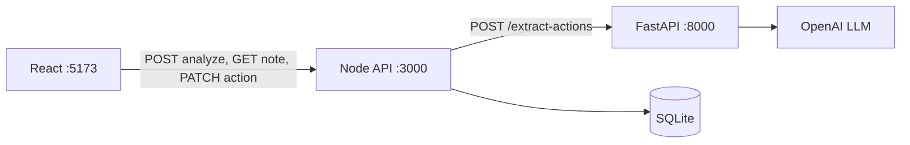

# Clinical Follow-Up Detector

A portfolio project that analyzes **fictional** clinical text notes and extracts explicit treatment and follow-up actions into structured, reviewable tasks.

**Safety disclaimer:** This is a demonstration system. It has **not been clinically validated** and must not be used for medical decision-making or real patient data. It is not HIPAA compliant. All extracted actions require human review. AI output is not automatically confirmed.

---

## Problem statement

Clinical notes often bury explicit follow-up instructions in unstructured prose. This application surfaces those instructions as structured actions that a human can review, edit, confirm, reject, or mark complete.

---

## What is implemented

Verified against source code and automated test suites (mocked LLM in tests).

**End-to-end:**

- React note input and `.txt` upload with client-side validation
- Analyze flow with action cards, evidence, and **Needs review** / **Why review is needed** UI
- Confirm, reject, edit, and complete workflow
- Saved note reload via `GET /api/notes/:noteId` — automatically from `?noteId=` in the URL after analyze, or manually by note ID
- Node.js API validation, workflow rules, and SQLite persistence
- Python FastAPI + OpenAI extraction with post-LLM checks
- Automated tests across React, Node, and Python

**Current limitation**

- Saved notes can be restored through `?noteId=` or by entering a note ID manually.
- The application does not automatically remember the most recently opened note when the URL contains no `noteId`.

---

## Architecture



- **React** talks only to the Node API (Vite proxies `/api` to port 3000).
- **Node** validates requests, calls Python, maps `snake_case` → `camelCase`, and persists to SQLite.
- **Python** builds prompts, calls OpenAI, and validates structured extraction output.
- The browser never calls Python or OpenAI directly.

Details: [docs/architecture.md](docs/architecture.md)

---

## Service responsibilities

| Service | Owns |
|---------|------|
| **React** (`apps/web`) | Input, presentation, saved-note reload, review/edit/complete interactions |
| **Node API** (`apps/api`) | Public HTTP API, Zod validation, Python client, IDs, workflow rules, SQLite |
| **Python AI** (`apps/ai-service`) | Prompts, LLM calls, JSON parsing, Pydantic validation, evidence checks |
| **SQLite** (via Node) | Notes, actions, review/completion state, timestamps |

---

## Key engineering decisions

- **Node.js is the application boundary.** It owns request validation, ID assignment, workflow rules, application error responses, and SQLite persistence.
- **Python is an isolated AI service.** It owns prompt construction, LLM communication, structured parsing, and AI-specific validation — not review state or database access.
- **The browser never talks to Python or OpenAI.** React uses only the Node API, keeping provider credentials and prompts off the client.
- **LLM output is untrusted input.** Node validates the Python response with Zod before mapping fields or writing to SQLite.
- **Evidence is checked against the submitted note.** Python post-validation verifies that extracted evidence appears in the source text; failures are flagged for review rather than silently accepted.
- **Analyze saves atomically.** The note and its actions are inserted in one SQLite transaction; invalid AI responses do not create partial records.
- **Human review is mandatory.** New actions start as `pending`; nothing is auto-confirmed in the UI or API.

---

## Technology stack

| Layer | Technology |
|-------|------------|
| Frontend | React, TypeScript, Vite, Vitest, Testing Library |
| Application API | Node.js, Express, TypeScript, Zod, better-sqlite3 |
| AI service | Python, FastAPI, Pydantic, OpenAI SDK |
| Database | SQLite |
| Validation | Zod (Node), Pydantic (Python) |

---

## Example

**Fictional note:**

```text
Repeat CBC in seven days and schedule an oncology follow-up next month.
```

**Illustrative extraction** (exact titles and wording may vary between LLM runs):

Assuming `REFERENCE_DATE=2026-06-06`, `"normalizedDeadline": "2026-06-13"` is correct because June 13, 2026 is exactly seven days after June 6, 2026.

```json
{
  "actions": [
    {
      "title": "Repeat CBC",
      "type": "test",
      "deadlineText": "in seven days",
      "normalizedDeadline": "2026-06-13",
      "priority": "medium",
      "evidence": "Repeat CBC in seven days",
      "needsReview": false
    },
    {
      "title": "Schedule oncology follow-up",
      "type": "appointment",
      "deadlineText": "next month",
      "normalizedDeadline": null,
      "priority": "medium",
      "evidence": "schedule an oncology follow-up next month",
      "needsReview": true
    }
  ]
}
```

Node adds workflow fields (`id`, `noteId`, `reviewStatus`, `completionStatus`, timestamps) before returning data to React.

---

## Prerequisites

- Node.js 18+, Python 3.11+, npm
- **OpenAI API credentials** in `apps/ai-service/.env` (`LLM_API_KEY`, `LLM_MODEL`) for live analyze
- Test suites mock the LLM and do not require a paid key

---

## Environment variables

Copy sections from root [`.env.example`](.env.example) into per-service `.env` files. **Never commit** API keys or real `.env` files.

### Node API — `apps/api/.env`

| Variable | Default | Purpose |
|----------|---------|---------|
| `PORT` | `3000` | Express listen port |
| `AI_SERVICE_URL` | `http://localhost:8000` | Python service base URL |
| `MAX_NOTE_LENGTH` | `20000` | Maximum note characters |
| `REFERENCE_DATE` | today's date | Relative deadline resolution (`YYYY-MM-DD`) |
| `AI_SERVICE_TIMEOUT_MS` | `30000` | Python call timeout (ms) |
| `DATABASE_PATH` | `data/app.db` | SQLite file path |

### Python AI — `apps/ai-service/.env`

| Variable | Default | Purpose |
|----------|---------|---------|
| `LLM_API_KEY` | — | **Required.** OpenAI API key |
| `LLM_MODEL` | — | **Required.** Model name |
| `LLM_TIMEOUT_SECONDS` | `30` | LLM request timeout |

### React — `apps/web`

No environment variables required (Vite proxies `/api` to `http://localhost:3000`).

---

## Quick start

Run in **three separate PowerShell windows**, in this order:

**1. Python AI** (`http://localhost:8000`)

```powershell
Set-Location apps\ai-service
python -m venv .venv
.\.venv\Scripts\Activate.ps1
pip install -r requirements.txt
# Create apps\ai-service\.env with LLM_API_KEY and LLM_MODEL
python main.py
```

**2. Node API** (`http://localhost:3000`)

```powershell
Set-Location apps\api
npm install
npm run dev
```

**3. React** (`http://localhost:5173`)

```powershell
Set-Location apps\web
npm install
npm run dev
```

Open `http://localhost:5173` and analyze a note from [`samples/01-clear-test-deadline.txt`](samples/01-clear-test-deadline.txt). After analyze, the URL includes `?noteId=...` so a refresh reloads the saved note and actions.

Health checks:

```powershell
Invoke-RestMethod -Uri "http://localhost:8000/health"
Invoke-RestMethod -Uri "http://localhost:3000/health"
```

Detailed setup, smoke tests, and definition of done: [docs/integration-checklist.md](docs/integration-checklist.md)

---

## API endpoints

| Endpoint | Purpose |
|----------|---------|
| `POST /api/notes/analyze` | Accept note text, call Python extraction, save to SQLite, return `201` with actions |
| `GET /api/notes/:noteId` | Return persisted note text and actions; used by React for URL-based and manual reload |
| `PATCH /api/actions/:actionId` | Confirm, reject, edit, or complete an action |

Full request bodies, response shapes, status codes, enums, and error codes: [docs/contracts.md](docs/contracts.md)

---

## LLM usage

The LLM is used **only as an extraction component**. Application validation, workflow transitions, persistence, and review rules remain deterministic and are owned by the Node API.

OpenAI receives fictional note text via the Python service. The model must:

- Extract only actions explicitly supported by the note
- Copy evidence from the note (not invent it)
- Avoid diagnoses, treatment recommendations, or invented deadlines
- Flag uncertain output for human review and include an uncertainty reason

The same note may produce slightly different wording across runs.

---

## Validation

| Layer | Checks |
|-------|--------|
| React | Non-empty note, length limit, `.txt` files only |
| Node | Zod on analyze request, PATCH body, and Python response |
| Python | Pydantic models, evidence-in-note verification, deadline safety rules |

Extracted action fields: `title`, `type`, `deadlineText`, `normalizedDeadline`, `priority`, `evidence`, `needsReview`, `uncertaintyReason`. Evidence cannot be edited via PATCH.

---

## Human-review workflow

1. New actions: `reviewStatus: pending`, `completionStatus: open`
2. User confirms or rejects each action
3. Only **confirmed** actions can be marked completed
4. **Rejected** actions cannot be completed (Node returns `409`)
5. User may edit title, type, deadlines, and priority

---

## Persistence

- SQLite is owned by the Node API (`DATABASE_PATH`, default `data/app.db`)
- Analyze writes the note and all actions in one transaction after a valid Python response
- Failed or invalid AI responses do not save partial data

---

## Testing

All suites mock the LLM — no paid API calls during tests.

The repository includes automated test suites across React, Node, and Python. All suites must pass.

Replace `<repository-root>` with your local clone path (for example, `C:\Users\you\Projects\clinical-follow-up-detector`).

```powershell
Set-Location <repository-root>\apps\api
npm test

Set-Location <repository-root>\apps\web
npm test

Set-Location <repository-root>\apps\ai-service
.\.venv\Scripts\Activate.ps1
pip install -r requirements-dev.txt
python -m pytest tests\ -q
```

---

## Sample notes

Seven fictional notes in [`samples/`](samples/) with varied clinical formats and dates. LLM output is not guaranteed; use these for manual and contract-level testing.

| File | Contract-level expectation |
|------|----------------------------|
| `01-clear-test-deadline.txt` | Primary demo — multiple action types; completed radiotherapy not a future task |
| `02-appointment-follow-up.txt` | Appointment follow-up in two weeks |
| `03-urgent-warning.txt` | Warning with explicit urgency wording |
| `04-ambiguous-deadline.txt` | `needsReview: true` for vague timing (`soon`) |
| `05-no-follow-up-actions.txt` | **No actions** |
| `06-completed-treatment.txt` | No future task for completed chemotherapy |
| `07-prompt-injection.txt` | Prompt-injection text is treated as untrusted note content; only explicit clinical follow-up actions should be extracted |

---

## Known limitations

- Saved notes can be restored through `?noteId=` or manual note ID entry, but the app does not automatically remember the last opened note when the URL contains no `noteId`
- OpenAI API key required for live analyze
- Fictional data only — not evaluated for real clinical use

---

## Documentation

| Document | Purpose |
|----------|---------|
| [docs/contracts.md](docs/contracts.md) | API and data contracts |
| [docs/architecture.md](docs/architecture.md) | Sequences and boundaries |
| [docs/integration-checklist.md](docs/integration-checklist.md) | PowerShell smoke tests |
