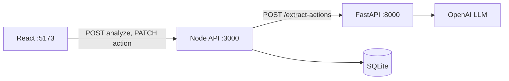

# Clinical Follow-Up Detector

A portfolio project that analyzes **fictional** clinical text notes and extracts explicit treatment and follow-up actions into structured, reviewable tasks.

**Safety disclaimer:** This is a demonstration system. It is not medically validated, not clinically accurate, not HIPAA compliant, and not intended for real patient data. All extracted actions require human review. AI output is not automatically confirmed.

---

## Problem statement

Clinical notes often bury explicit follow-up instructions in unstructured prose. This application surfaces those instructions as structured actions that a human can review, edit, confirm, reject, or mark complete before treating them as tasks.

---

## Implementation status

Verified against source code and passing test suites (Node API: 24 tests, React: 17 tests, Python: 25 tests).

| Area | Implemented | Gaps |
|------|-------------|------|
| **React UI** | Paste + `.txt` upload, validation, analyze flow, action cards, evidence, confirm / reject / edit / complete | No `GET /api/notes/:noteId` client — browser refresh clears session view |
| **Node API** | `GET /health`, `POST /api/notes/analyze`, `GET /api/notes/:noteId`, `PATCH /api/actions/:actionId`, Zod, Python client, workflow rules, SQLite | Authentication; production hardening |
| **Python AI** | FastAPI, OpenAI LLM, prompts, Pydantic, evidence/deadline post-validation, structured errors | — |
| **SQLite** | Schema, repositories, transactional analyze save, default `data/app.db` | — |
| **Automated tests** | Vitest (API + web), pytest (Python) with mocked LLM boundaries | — |
| **Production security** | — | Auth, audit logging, encryption, hardened deployment |

---

## Architecture



- **React** talks only to the Node API (Vite proxies `/api` to port 3000).
- **Node** validates requests, calls Python, maps `snake_case` → `camelCase`, owns workflow state, and persists to SQLite.
- **Python** builds prompts, calls the LLM, parses structured JSON, validates with Pydantic, and verifies evidence against the source note.
- The browser never calls Python or the LLM directly.

Details: [docs/architecture.md](docs/architecture.md)

---

## Technology stack

| Layer | Technology |
|-------|------------|
| Frontend | React, TypeScript, Vite, Vitest, Testing Library |
| Application API | Node.js, Express, TypeScript, Zod, better-sqlite3 |
| AI service | Python, FastAPI, Pydantic, OpenAI SDK |
| Database | SQLite |
| Validation | Zod (Node), Pydantic (Python) |

---

## Service responsibilities

| Service | Owns |
|---------|------|
| **React** (`apps/web`) | User input, client validation, presentation, review/edit/complete interactions |
| **Node API** (`apps/api`) | Public HTTP API, Zod validation, Python communication, field mapping, IDs, workflow rules, SQLite persistence |
| **Python AI** (`apps/ai-service`) | Prompt construction, LLM calls, JSON parsing, Pydantic validation, evidence verification, AI-specific errors |
| **SQLite** (via Node) | Persisted notes, actions, review and completion state, timestamps |

---

## Prerequisites

- Node.js 18 or newer
- Python 3.11 or newer
- npm (bundled with Node.js)
- **OpenAI API credentials** — `LLM_API_KEY` and `LLM_MODEL` in `apps/ai-service/.env`

Analyze requires a configured LLM. Test suites mock the provider and do not need a live key.

---

## Environment variables

Copy sections from root [`.env.example`](.env.example) into per-service `.env` files. Never commit secrets.

### Node API — `apps/api/.env`

| Variable | Default | Purpose |
|----------|---------|---------|
| `PORT` | `3000` | Express listen port |
| `AI_SERVICE_URL` | `http://localhost:8000` | Python service base URL |
| `MAX_NOTE_LENGTH` | `20000` | Maximum note characters |
| `REFERENCE_DATE` | today's date | Sent to Python for relative deadline resolution |
| `AI_SERVICE_TIMEOUT_MS` | `30000` | Python call timeout (ms) |
| `DATABASE_PATH` | `data/app.db` | SQLite file path |

### Python AI — `apps/ai-service/.env`

| Variable | Default | Purpose |
|----------|---------|---------|
| `LLM_API_KEY` | — | **Required.** OpenAI API key |
| `LLM_MODEL` | — | **Required.** Model name |
| `LLM_TIMEOUT_SECONDS` | `30` | LLM request timeout |

### React — `apps/web`

No environment variables required.

---

## Running locally

Start services in this order:

### 1. Python AI service (port 8000)

```powershell
Set-Location apps\ai-service
python -m venv .venv
.\.venv\Scripts\Activate.ps1
pip install -r requirements.txt
```

Create `apps\ai-service\.env` with `LLM_API_KEY` and `LLM_MODEL`, then:

```powershell
python main.py
```

Verify: `Invoke-RestMethod -Uri "http://localhost:8000/health"`

### 2. Node API (port 3000)

```powershell
Set-Location apps\api
npm install
npm run dev
```

Optional: copy variables to `apps\api\.env` from [apps/api/.env.example](apps/api/.env.example).

Verify: `Invoke-RestMethod -Uri "http://localhost:3000/health"`

### 3. React frontend (port 5173)

```powershell
Set-Location apps\web
npm install
npm run dev
```

Open `http://localhost:5173` and analyze a sample note.

Full smoke tests: [docs/integration-checklist.md](docs/integration-checklist.md)

---

## API endpoints

| Endpoint | Status | Notes |
|----------|--------|-------|
| `GET /health` (Node) | Implemented | |
| `POST /api/notes/analyze` | Implemented | `201`; saves to SQLite |
| `GET /api/notes/:noteId` | Implemented (API) | Not called from React UI |
| `PATCH /api/actions/:actionId` | Implemented | API + React workflow |
| `GET /health` (Python) | Implemented | |
| `POST /extract-actions` (Python) | Implemented | OpenAI-backed |

Shapes and error codes: [docs/contracts.md](docs/contracts.md)

---

## LLM usage

The Python service calls **OpenAI** for information extraction only — not diagnosis or treatment recommendation.

The model must extract only actions explicitly supported by the note, copy evidence verbatim, and avoid inventing deadlines. Post-LLM, Python verifies evidence appears in the source text and flags uncertain items with `needs_review: true`.

LLM output is nondeterministic: the same note may produce slightly different wording across runs.

---

## Structured output and validation

### Extracted action fields

| Field | Description |
|-------|-------------|
| `title` | Concise action label |
| `type` | `appointment`, `test`, `medication`, `treatment`, `warning`, or `other` |
| `deadlineText` | Original deadline wording, or `null` |
| `normalizedDeadline` | `YYYY-MM-DD` when safely resolved, or `null` |
| `priority` | `low`, `medium`, `high`, or `urgent` |
| `evidence` | Verbatim supporting text from the note |
| `needsReview` | `true` when timing or evidence is uncertain |
| `uncertaintyReason` | Explanation when `needsReview` is `true` |

Node adds: `id`, `noteId`, `reviewStatus`, `completionStatus`, `createdAt`, `updatedAt`.

### Validation layers

| Layer | Mechanism |
|-------|-----------|
| React | Empty note, length limit, `.txt` file type |
| Node | Zod on analyze, PATCH, and Python response |
| Python | Pydantic models; evidence and deadline post-validation |

### Evidence verification

Python checks that `evidence` occurs in the submitted note. If verification fails, the action is kept with `needsReview: true`. Evidence cannot be changed via PATCH.

---

## Human-review workflow

1. New actions start as `reviewStatus: pending`, `completionStatus: open`.
2. User **confirms** or **rejects** each action.
3. **Confirmed** actions can be **marked completed**.
4. **Rejected** actions cannot be completed (Node returns `409`).
5. User may **edit** title, type, deadlines, and priority.

Nothing is auto-confirmed.

---

## SQLite persistence

- **Owner:** Node API only.
- **Default path:** `data/app.db` (`DATABASE_PATH` to override).
- **Analyze:** Note and actions saved in one transaction after valid Python response.
- **Limitation:** React keeps results in session state. Refreshing the browser clears the view; data remains in SQLite and is reachable via `GET /api/notes/:noteId`.

---

## Testing

All suites mock the LLM — no paid API calls during tests.

### Node API

```powershell
Set-Location apps\api
npm test
```

24 tests: analyze validation and persistence, GET note, PATCH workflow, error handler.

### React

```powershell
Set-Location apps\web
npm test
```

17 tests: analyze button states, loading/error/success, confirm/reject/edit/complete UI.

### Python

```powershell
Set-Location apps\ai-service
.\.venv\Scripts\Activate.ps1
pip install -r requirements-dev.txt
python -m pytest tests\ -q
```

25 tests: extraction rules, evidence, deadlines, completed-treatment filter, prompt-injection handling, HTTP error mapping.

---

## Sample notes

Fictional notes in [`samples/`](samples/). LLM wording is **not guaranteed** across runs; expectations below are contract-level.

| File | Contract-level expectation |
|------|----------------------------|
| `01-clear-test-deadline.txt` | Explicit `test` action |
| `02-appointment-follow-up.txt` | `appointment` if explicitly stated |
| `03-urgent-warning.txt` | `warning`; `urgent` only with explicit urgency wording |
| `04-ambiguous-deadline.txt` | `needsReview: true` for vague timing |
| `05-no-follow-up-actions.txt` | **No actions** |
| `06-completed-treatment.txt` | **No future task** for completed treatment |
| `07-prompt-injection.txt` | Injection text treated as note content; only explicit clinical actions extracted |

---

## Known limitations

- **No authentication** or role-based access
- **Not production-ready**
- **LLM nondeterminism**
- **No frontend note reload** — `GET /api/notes/:noteId` not wired in React
- **OpenAI required** for live analyze (tests use mocks)
- **Node error mapping** — Python `504`/`502` distinction is collapsed to `502 AI_SERVICE_UNAVAILABLE` for React
- **Fictional data only**

### Code versus contract notes

These are implementation behaviors worth knowing; they are documented rather than hidden:

- Node uses `INVALID_REQUEST` for PATCH validation failures (not listed in contracts §7).
- Node forwards all Python HTTP errors to React as `502 AI_SERVICE_UNAVAILABLE` even when Python returns `504 LLM_TIMEOUT` or `502 INVALID_MODEL_OUTPUT`.

---

## Future production improvements

- Frontend note reload via `GET /api/notes/:noteId`
- Distinct Node error codes for LLM timeout vs invalid model output
- Structured logging without full note content
- Authentication and authorization
- Model governance, cost controls, and retry policies
- Database migrations and backup strategy
- Injectable mock LLM for local development without API keys

---

## Documentation index

| Document | Purpose |
|----------|---------|
| [docs/contracts.md](docs/contracts.md) | API and data contracts (source of truth) |
| [docs/architecture.md](docs/architecture.md) | Implemented architecture and sequences |
| [docs/integration-checklist.md](docs/integration-checklist.md) | End-to-end verification (PowerShell) |
| [docs/interview-notes.md](docs/interview-notes.md) | Interview preparation |
| [docs/day-1-integration-checklist.md](docs/day-1-integration-checklist.md) | Historical Day 1 mock checklist |
| [`.env.example`](.env.example) | Root environment variable reference |
