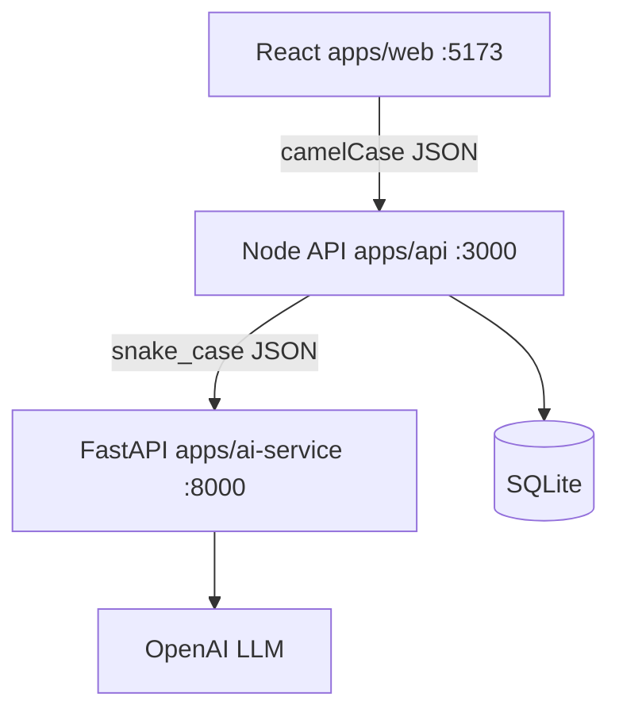
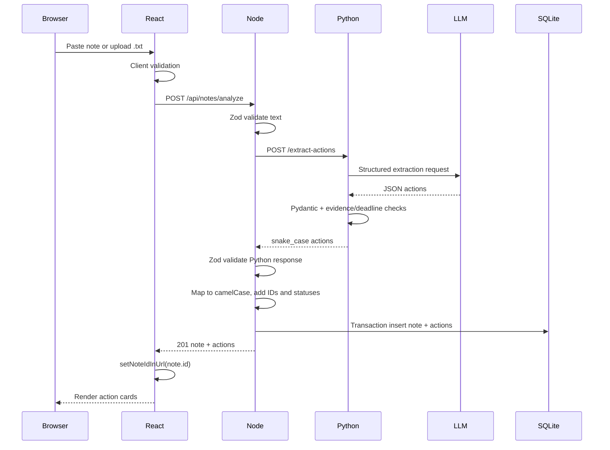
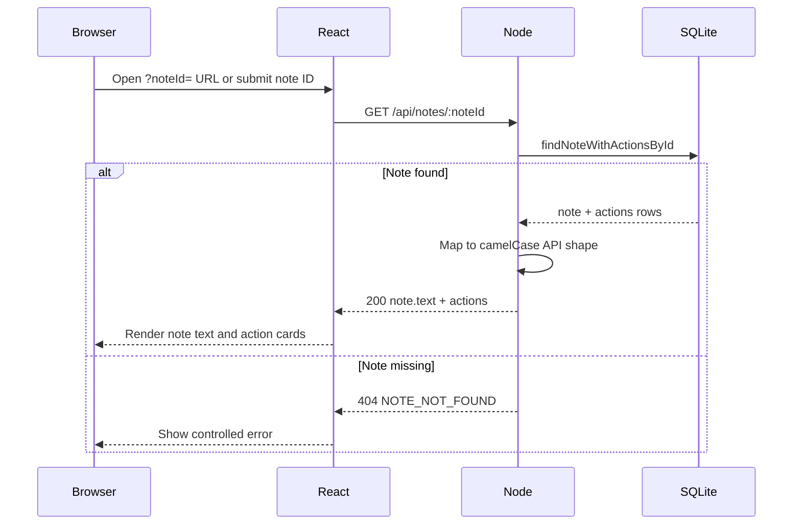
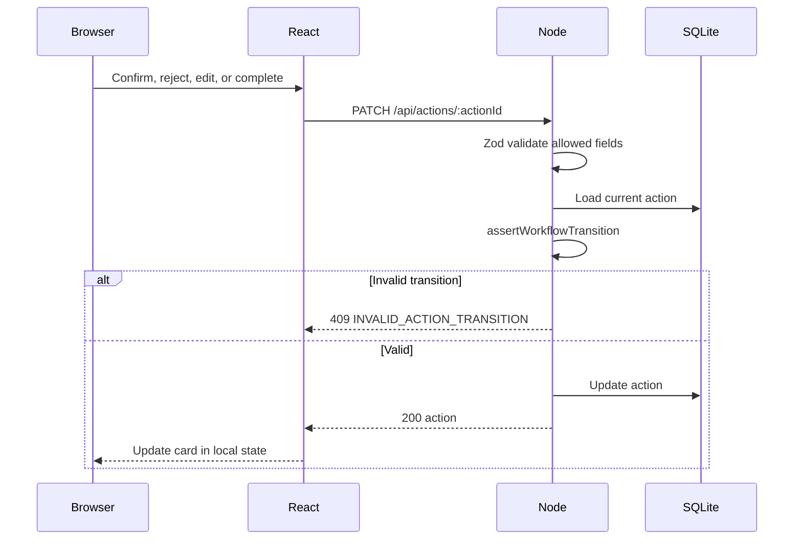

# Architecture

This document describes the **implemented** architecture of the Clinical Follow-Up Detector. It focuses on service boundaries, data flow, and architectural reasoning rather than low-level contract details.

For endpoint shapes, field names, enums, and error codes, see [contracts.md](contracts.md).

## Architectural goals

The architecture was designed to:

- Isolate LLM-specific concerns from application and workflow logic
- Treat all AI output as untrusted input
- Require human review before extracted actions are treated as confirmed tasks
- Prevent partial persistence when extraction or validation fails
- Keep provider credentials and prompts outside the browser

---

## System overview

- **React** sends note text, saved-note reload requests, and action updates to the Node API only.
- **Node** validates input, calls Python, maps field names, assigns IDs and workflow defaults, enforces transitions, and persists to SQLite.
- **Python** builds prompts, calls OpenAI, parses structured JSON, validates with Pydantic, and post-validates evidence and deadlines.
- The browser never calls Python or the LLM directly.

---

## Service ownership

| Service | Owns |
|---------|------|
| **React** | Input, client-side validation, presentation, saved-note reload, review/edit/complete interactions |
| **Node API** | Public HTTP API, request validation, workflow rules, IDs, application errors, Python communication, SQLite persistence |
| **Python AI** | Prompts, LLM communication, structured parsing, AI-specific validation, evidence/deadline checks |
| **SQLite** (via Node) | Notes, actions, workflow state, timestamps |

---

The following sequences show the three primary application flows: analyzing a note, reloading a saved note, and updating an extracted action.

## Analyze sequence

**Failure behavior:** If Python returns an error or the response fails Node validation, Node returns `502` and **does not** write to SQLite.

---

## GET note sequence

After analyze, React writes `?noteId=` into the URL so a refresh reloads the saved note and actions. Users can also load a saved note manually by ID.

---

## PATCH action sequence

**Workflow rules (Node):**

- New extractions start as `reviewStatus: pending`, `completionStatus: open`.
- Allowed transitions: `pending+open → confirmed+open`, `pending+open → rejected+open`, `confirmed+open → confirmed+completed`.
- Terminal states: `rejected+open` and `confirmed+completed` cannot be edited or changed further.
- `completionStatus: completed` requires `reviewStatus: confirmed`.
- Repeating the current review or completion state is allowed (idempotent success).
- `evidence`, `needsReview`, and `uncertaintyReason` are not PATCH-editable.
- `needsReview` does not block confirmation or completion; it flags AI uncertainty for human review.

Field definitions, transition matrix, and editable PATCH fields are in [contracts.md](contracts.md).

---

## Validation and trust boundaries

Validation is intentionally layered:

- React performs early client-side checks for immediate user feedback.
- Node validates all public requests and treats Python responses as untrusted input.
- Python validates structured LLM output and checks evidence and deadline safety.
- Persistence occurs only after all validation layers succeed.

---

## Persistence and atomicity

- **Owner:** Node API only (`better-sqlite3`).
- **Default path:** `data/app.db` (override with `DATABASE_PATH`).
- **Schema:** `notes` and `actions` per [contracts.md](contracts.md) §9.

The analyze operation is atomic: either the note and all validated actions are persisted together, or nothing is written. `insertNoteWithActions` runs in a SQLite transaction after Python returns a response that passes Node validation. Invalid AI responses abort before any write.

---

## Testing strategy

Each service tests its own boundary with the external dependency mocked:

- **Node API** — Vitest and Supertest with in-memory SQLite and a mocked Python client (`npm test` in `apps/api`).
- **React** — Vitest and Testing Library with mocked `fetch` (`npm test` in `apps/web`).
- **Python** — pytest with an injected or mocked `llm_complete` boundary (`python -m pytest tests\` in `apps/ai-service`).

No default test suite calls the paid OpenAI API. The repository includes automated test suites across React, Node, and Python. All suites must pass.

---

## Health endpoints

`GET /health` on Node and Python verifies only that each process is running (liveness). Neither endpoint checks database connectivity, Python availability from Node, or LLM configuration. Dependency-aware readiness checks would be added for production deployment.

---

## Timeout behavior

- **Python** uses `LLM_TIMEOUT_SECONDS` and returns `504 LLM_TIMEOUT` when the provider does not respond in time.
- **Node** uses `AI_SERVICE_TIMEOUT_MS` when calling Python and returns `502 AI_SERVICE_UNAVAILABLE` when the request fails or times out.
- When Python returns a non-success status (including `504`) during analyze, Node maps it to a controlled upstream error for React without exposing provider details. No data is saved after a timeout.

---

## Current safety and privacy boundaries

- Fictional medical notes only.
- LLM API keys stay in the Python service environment.
- React does not store or receive provider credentials.
- Routine error responses do not include the full submitted note.
- The system does not diagnose, prescribe, or auto-confirm extracted actions.

This portfolio project is not production-ready, not HIPAA compliant, and not validated for real patient data.

---

## Architectural trade-offs

- **SQLite** keeps local setup simple, but a production multi-user system would require a managed relational database and migrations.
- **Splitting Node and Python** adds operational complexity, but creates clear ownership between application logic and AI-specific concerns.
- **Evidence verification** reduces unsupported output, but direct text matching may flag valid paraphrases for human review.
- **Using one LLM provider** keeps the implementation focused, but creates provider dependency.
- **URL-based note reload** is simple and transparent, but the application does not yet include user accounts or a note-history screen.
- **Error abstraction:** Python distinguishes timeout, provider, and invalid-output failures, while Node currently exposes most upstream failures through a single application-level error. A production version would preserve safe error granularity without leaking provider details. See [contracts.md](contracts.md) for the complete error schema.

---

## Documentation references

| Document | Purpose |
|----------|---------|
| [contracts.md](contracts.md) | API shapes, field mappings, enums, error codes, persistence schema |
| [integration-checklist.md](integration-checklist.md) | Local setup, smoke tests, definition of done |
| [README.md](../README.md) | Quick start, environment variables, sample notes |
