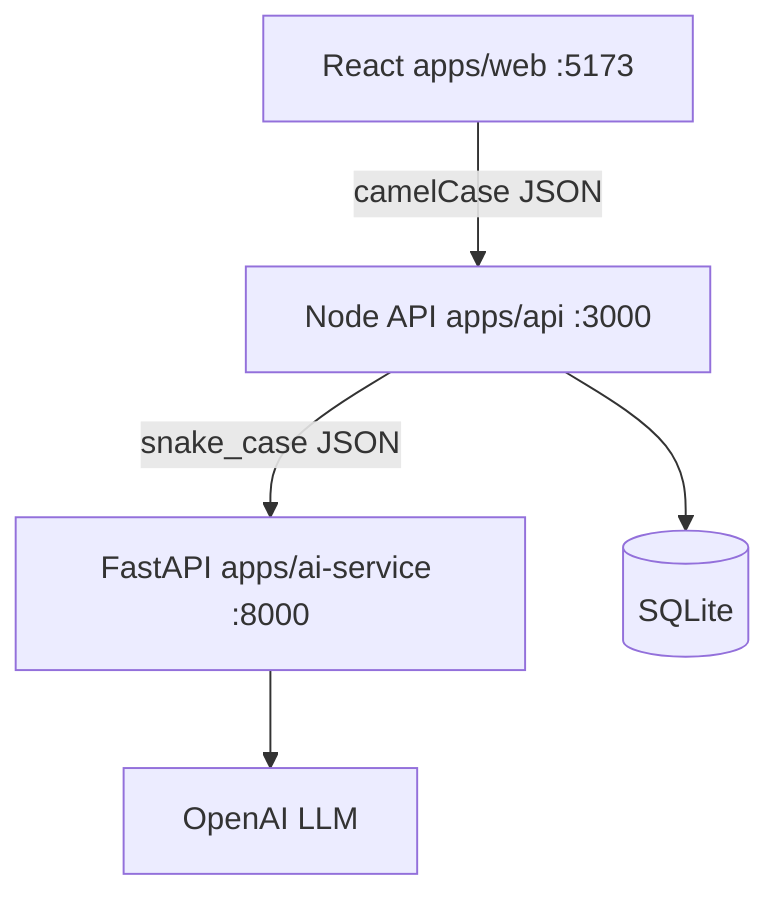
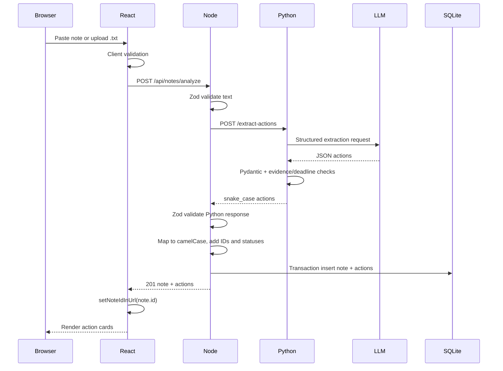
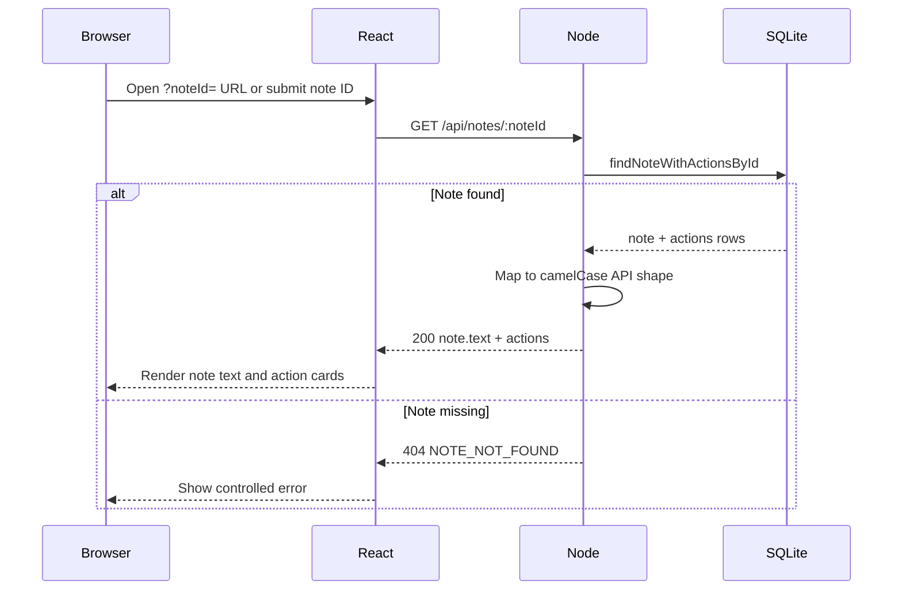
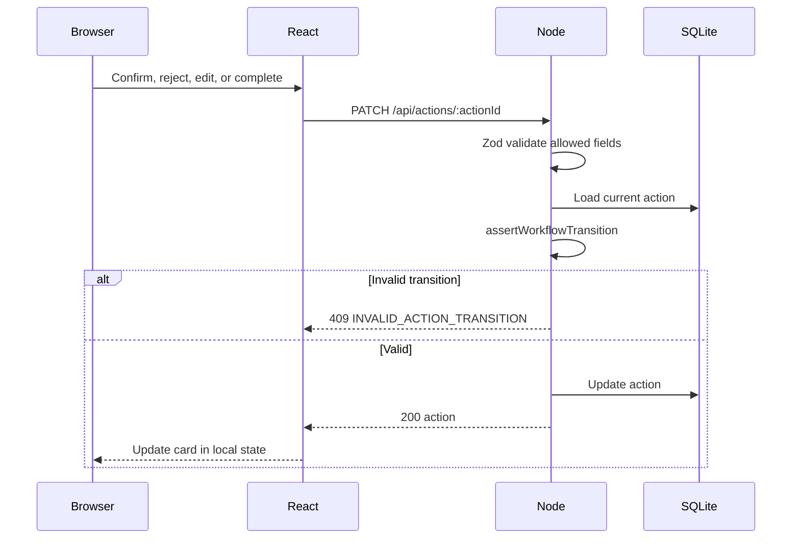

# Architecture

This document describes the **implemented** architecture of the Clinical Follow-Up Detector.

For endpoint shapes, field names, and enums, see [contracts.md](contracts.md).

---

## System overview



- **React** sends note text, saved-note reload requests, and action updates to the Node API only.
- **Node** validates input, calls Python, maps field names, assigns IDs and workflow defaults, enforces transitions, and persists to SQLite.
- **Python** builds prompts, calls OpenAI, parses structured JSON, validates with Pydantic, and post-validates evidence and deadlines.
- The browser never calls Python or the LLM directly.

---

## Service ownership

| Service | Owns | Does not own |
|---------|------|--------------|
| **React** | Input, client validation, presentation, saved-note reload, confirm/reject/edit/complete UI | LLM calls, persistence, prompts |
| **Node API** | Public HTTP API, Zod validation, Python client, snake_case→camelCase mapping, IDs, workflow rules, SQLite, application errors | Prompt construction, direct LLM calls |
| **Python AI** | Prompts, LLM client, JSON parsing, Pydantic validation, evidence/deadline post-checks, AI-specific errors | Persistence, review/completion state, browser API |
| **SQLite** (via Node) | Notes, actions, review and completion state, timestamps | — |

---

## Analyze sequence



**Failure behavior:** If Python returns an error or the response fails Zod validation, Node returns `502` and **does not** write to SQLite.

---

## GET note sequence



**Product note:** After analyze, React writes `?noteId=` into the URL so a refresh reloads the saved note and actions. Users can also load a saved note manually by ID. The app does not automatically remember the most recently opened note when the URL contains no `noteId`.

---

## PATCH action sequence



**Workflow rules (Node):**

- New extractions start as `reviewStatus: pending`, `completionStatus: open`.
- `completionStatus: completed` requires `reviewStatus: confirmed`.
- Rejected actions cannot be completed.
- Rejecting sets `completionStatus` back to `open`.
- Completed actions cannot be rejected or reopened.
- `evidence`, `needsReview`, and `uncertaintyReason` are not PATCH-editable.

---

## Naming boundary

| Layer | Convention | Example |
|-------|--------------|---------|
| React / Node API responses | `camelCase` | `deadlineText`, `needsReview` |
| Python request/response | `snake_case` | `deadline_text`, `needs_review` |
| SQLite columns | `snake_case` | `deadline_text`, `review_status` |

**Node maps** at two boundaries:

1. Python → application entities (analyze)
2. SQLite rows ↔ API entities (read/write)

React must never receive Python field names.

---

## Validation boundaries

| Layer | What is validated |
|-------|-------------------|
| **React** | Non-empty note, max length, `.txt` only, empty file rejected |
| **Node (analyze)** | Request body; Python response shape and enums; uncertainty field pairing |
| **Node (PATCH)** | Allowed fields only (`.strict()`); at least one field; workflow transitions |
| **Python** | Request body; LLM JSON schema; Pydantic models; evidence in note; deadline rules; urgent-only-with-explicit-wording |

---

## Error propagation

### Node → React

All Node errors use:

```json
{ "error": { "code": "...", "message": "..." } }
```

Common codes: `INVALID_NOTE`, `NOTE_TOO_LONG`, `NOTE_NOT_FOUND`, `ACTION_NOT_FOUND`, `INVALID_REQUEST`, `INVALID_ACTION_TRANSITION`, `AI_SERVICE_UNAVAILABLE`, `INVALID_AI_RESPONSE`, `INTERNAL_ERROR`.

### Python → Node

Python returns structured errors per [contracts.md](contracts.md) §8, including `LLM_TIMEOUT` (504), `LLM_PROVIDER_ERROR` (502), and `INVALID_MODEL_OUTPUT` (502).

**Known cross-service behavior:** Node's `aiServiceClient` maps **all** non-OK Python HTTP responses to `502 AI_SERVICE_UNAVAILABLE` for the browser. Distinct Python error codes are not forwarded to React today.

### Python internal

Unhandled exceptions may return FastAPI's default 500 envelope rather than the structured `ErrorResponse` shape.

---

## Persistence and transactions

- **Owner:** Node API only (`better-sqlite3`).
- **Default path:** `data/app.db` (override with `DATABASE_PATH`).
- **Schema:** `notes` and `actions` per contracts §9.
- **Booleans:** `needs_review` stored as `0` / `1`, exposed to React as JavaScript booleans.
- **Analyze save:** `insertNoteWithActions` runs in a SQLite transaction. Invalid AI responses abort before any write.

---

## Testing architecture

| Service | Framework | Command | Strategy |
|---------|-----------|---------|----------|
| **Node API** | Vitest + Supertest | `npm test` in `apps/api` | In-memory SQLite; mocked Python client; tests analyze, GET, PATCH, errors |
| **React** | Vitest + Testing Library | `npm test` in `apps/web` | Mocked `fetch`; tests analyze flow, saved-note reload, workflow controls, error states |
| **Python** | pytest + pytest-asyncio | `python -m pytest tests\` in `apps/ai-service` | Injected `llm_complete` mock; blocks real OpenAI calls; tests extraction rules and HTTP error mapping |

No test calls a paid LLM in the default test suites. The repository includes around 70 automated tests across React, Node, and Python.

---

## Security and privacy boundaries

- Fictional medical notes only.
- LLM API keys stay in the Python service environment.
- React does not store or receive provider credentials.
- Full note text must not appear in routine error responses to the browser.
- The system does not diagnose, prescribe, or auto-confirm extracted actions.

This portfolio project is not production-ready, not HIPAA compliant, and not validated for real patient data.
