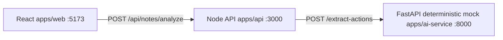
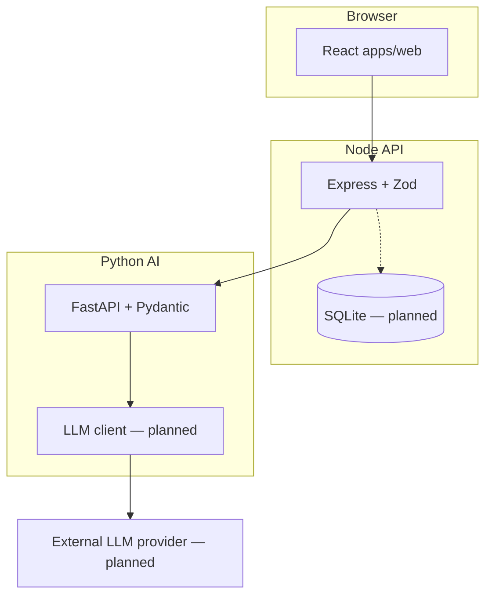

# Architecture

This document describes how the Clinical Follow-Up Detector is structured today (Day 1) and what is planned for later days.

For endpoint shapes, field names, and enums, see [contracts.md](contracts.md).

---

## Day 1 architecture (current)

On Day 1, the system runs as three local services with a **deterministic mock** in the Python layer. No external LLM is called. No database is used.

### Request flow (analyze)

1. The user pastes text or uploads a `.txt` file in the React app.
2. React validates input client-side and sends `POST /api/notes/analyze` with `{ "text": "..." }`.
3. The Node API validates the note with Zod, reads `reference_date` from config, and calls the Python service.
4. The Python service applies rule-based extraction (currently CBC + repeat + seven-day patterns) and returns validated Pydantic models.
5. The Node API validates the Python response, maps `snake_case` to `camelCase`, assigns in-memory IDs and workflow defaults (`reviewStatus: pending`, `completionStatus: open`), and returns `201 Created`.
6. React renders the returned actions or an empty-state message.

### Service responsibilities (Day 1)

| Service | Owns | Does not own |
|---------|------|--------------|
| **React** (`apps/web`) | Input, loading/error/success UI, read-only action display | LLM calls, persistence, workflow updates |
| **Node API** (`apps/api`) | Public API, Zod validation, Python client, field mapping, in-memory response shaping | Prompts, extraction logic, SQLite |
| **Python AI** (`apps/ai-service`) | `/health`, `/extract-actions`, Pydantic validation, deterministic mock extraction | Persistence, review/completion state, browser-facing API |

### Field naming boundary

- Python uses `snake_case` (for example `deadline_text`, `needs_review`).
- React and Node use `camelCase` (for example `deadlineText`, `needsReview`).
- **Node maps** Python responses before returning data to React.

### Error propagation

- Python returns structured errors to Node (`400`, `502`, `504` per contracts).
- Node converts failures into controlled application errors (`502` for unavailable or invalid AI responses).
- React shows user-facing messages; stack traces and provider details are not exposed.

### Day 1 mock behavior

The Python `extraction_service` is a **deterministic rule-based mock**, not an LLM:

- It looks for a sentence containing both a CBC/complete-blood-count reference and a repeat instruction.
- If a seven-day deadline phrase is present, it normalizes the date using `reference_date`.
- Notes that do not match those patterns return an empty `actions` list.

This is intentional for Day 1 integration: the full stack can be tested without API keys or nondeterministic model output.

---

## Planned architecture (Day 2+)

The following components are **designed** in [contracts.md](contracts.md) but **not implemented** yet. They are shown here for context only.

### Planned additions

| Component | Purpose |
|-----------|---------|
| **External LLM** | Replace the deterministic mock with provider-backed extraction |
| **SQLite** | Persist notes, actions, review status, and completion status |
| **Workflow endpoints** | `GET /api/notes/:noteId`, `PATCH /api/actions/:actionId` |
| **Review UI** | Confirm, reject, edit, and complete actions in React |
| **Automated tests** | Boundary and failure-case coverage across all three services |

### Planned persistence model

When SQLite is added, Node will own:

- `notes` — `id`, `original_text`, `created_at`
- `actions` — extraction fields plus `review_status`, `completion_status`, timestamps

See contracts §9 for the full schema. On Day 1, analyze responses use generated IDs but **nothing is saved** between requests.

---

## Security boundaries

This is a portfolio project using **fictional medical notes only**.

The system must not:

- Store or process real patient information
- Expose LLM API keys to the browser
- Allow React to call an LLM provider directly
- Present AI output as medically verified or automatically confirmed

All extracted actions require human review once that workflow is built.

---

## Contract reference

[contracts.md](contracts.md) is the source of truth for:

- Shared enums (action type, priority, review status, completion status)
- React ↔ Node and Node ↔ Python request/response shapes
- Error codes and HTTP status codes
- Planned SQLite schema and workflow rules

Do not change contracts without reviewing every affected service.
