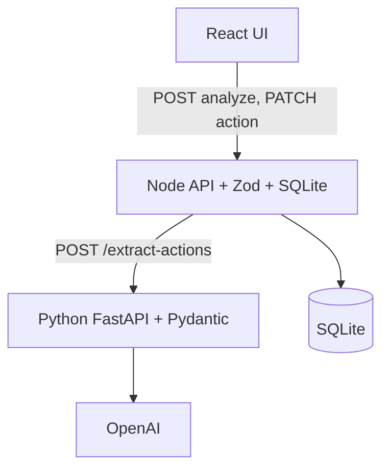

# Interview notes

Preparation guide for explaining the Clinical Follow-Up Detector portfolio project.

---

## 60-second project overview

This is a three-tier web application that reads **fictional** clinical notes and extracts explicit follow-up actions — appointments, tests, warnings, and similar instructions — into structured tasks a human can review.

A clinician or coordinator pastes a note, the system calls an LLM through a guarded Python service, and the Node API saves validated results to SQLite. The React UI shows each action with source evidence and lets the user confirm, reject, edit, or mark items complete.

It is a portfolio demo, not a medical product. It does not diagnose, does not auto-confirm AI output, and is not built for real patient data.

---

## 5-minute architecture explanation

**Why three services?**

1. **React** — presentation and human workflow only.
2. **Node** — application API, orchestration, persistence, and workflow rules.
3. **Python** — AI boundary: prompts, provider calls, parsing, and AI-specific validation.

**Key boundaries:**

- Browser never holds API keys or talks to OpenAI.
- Node maps `snake_case` (Python/SQLite) to `camelCase` (React).
- SQLite is owned exclusively by Node.
- Evidence from the LLM is verified against the source note before acceptance.

---

## Full analyze lifecycle

1. User pastes or uploads a `.txt` note in React.
2. React validates length and non-empty input.
3. React sends `POST /api/notes/analyze` with `{ text }`.
4. Node validates with Zod, adds `reference_date`, calls Python.
5. Python wraps the note in a delimited prompt, calls OpenAI with a strict JSON schema.
6. Python parses the response with Pydantic and runs post-checks (evidence in note, deadline rules, completed-treatment filter).
7. Node validates the Python payload with Zod, maps fields, assigns IDs, sets `pending`/`open`.
8. Node saves note + actions in a SQLite transaction.
9. Node returns `201` with camelCase entities.
10. React renders action cards. User reviews each item.

If Python fails or returns invalid JSON, Node returns `502` and **does not save**.

---

## GET note flow

1. Client calls `GET /api/notes/:noteId`.
2. Node loads note and actions from SQLite.
3. Node maps rows to camelCase API shape including `note.text`.
4. Returns `200` or `404 NOTE_NOT_FOUND`.

Implemented and tested on the API. React does not call it today, so a browser refresh clears the session view even though data persists.

---

## PATCH action flow

1. User confirms, rejects, edits, or completes an action in React.
2. React sends `PATCH /api/actions/:actionId` with only allowed fields.
3. Node validates body with Zod (`.strict()`).
4. Node loads current action, runs `assertWorkflowTransition`.
5. On success, Node updates SQLite and returns the updated action.
6. React replaces the action in local state.

Rejected actions cannot be completed. Completion requires prior confirmation.

---

## Design rationale

### Why React calls only Node

- Hides LLM keys and Python internals.
- Single application API for the browser.
- Node enforces workflow rules and persistence in one place.
- Easier to add auth, rate limits, and logging at the orchestration layer.

### Why Node and Python are separate

- Different responsibilities: orchestration vs AI extraction.
- Python can be swapped or scaled independently.
- Provider SDK and prompt logic stay out of the TypeScript codebase.
- Tests can mock the AI boundary cleanly (Node mocks Python; Python injects `llm_complete`).

### Why Node owns SQLite

- Persistence is application state, not an AI concern.
- Review and completion status are workflow fields Node adds after extraction.
- Transactional analyze save belongs with the orchestrator.
- Python remains stateless and easier to reason about.

### Why structured output is used

- LLM free text is hard to validate and map to UI fields.
- JSON schema + Pydantic catches missing fields, bad enums, and inconsistent uncertainty flags early.
- Node can apply a second Zod validation before any database write.

### How hallucination risk is reduced

- Prompt limits extraction to explicit note content.
- Evidence must be copied from the note and is verified post-LLM.
- Vague deadlines stay null with `needsReview: true`.
- `urgent` priority rejected unless evidence contains explicit urgency wording.
- Completed treatments without new follow-up are dropped.
- Invalid model output returns an error instead of silent bad data.

### Why evidence is required

- Gives the reviewer an audit trail to the source sentence.
- Supports quick rejection of invented actions.
- Post-validation ensures the quote actually appears in the note.

### Why human review is required

- LLMs can misread or over-extract.
- Medical workflow requires explicit human acceptance.
- `reviewStatus` (human decision) is separate from `needsReview` (AI uncertainty flag).

### Relative-date handling

- Node sends `reference_date` (`YYYY-MM-DD`) on every extraction request.
- Python uses it to resolve phrases like "within seven days" or "in two weeks".
- Server date is not guessed implicitly.
- Missing year or vague words (`soon`) → `normalizedDeadline: null`, `needsReview: true`.

### Prompt-injection mitigation

- Note is wrapped in `<clinical_note>` tags and treated as untrusted data.
- System instructions tell the model to ignore instructions inside the note.
- Tests confirm injection-like sentences do not crash the service.
- Extraction still follows explicit clinical wording only.

### Error handling

| Failure | Typical response |
|---------|------------------|
| Empty note | Node `400 INVALID_NOTE` |
| Python down | Node `502 AI_SERVICE_UNAVAILABLE` |
| Invalid Python JSON/shape | Node `502 INVALID_AI_RESPONSE`, no DB write |
| Missing LLM key | Python `502 LLM_PROVIDER_ERROR` |
| LLM timeout | Python `504 LLM_TIMEOUT` (Node currently maps to `502` for React) |
| Invalid PATCH | Node `400 INVALID_REQUEST` |
| Bad workflow transition | Node `409 INVALID_ACTION_TRANSITION` |

### Transaction behavior

`insertNoteWithActions` uses a SQLite transaction. Analyze either saves the full note and action set or saves nothing.

---

## Testing strategy

| Service | Command | Approach |
|---------|---------|----------|
| Node API | `npm test` | Vitest + Supertest; in-memory SQLite; mocked Python client |
| React | `npm test` | Vitest + Testing Library; mocked `fetch` |
| Python | `python -m pytest tests\` | Injected `llm_complete`; blocks real OpenAI |

**What tests protect:**

- Invalid input rejected before AI call
- No persistence on AI failure
- GET/PATCH contract shapes and workflow 409s
- UI disables analyze on empty input, shows loading/errors, updates on confirm/reject/complete
- Evidence verification, vague deadlines, completed-treatment drop, prompt-injection note content

**What is not integration-tested end-to-end with a live LLM:** full three-service analyze with real OpenAI (by design — cost and nondeterminism).

---

## Tradeoffs

| Choice | Benefit | Cost |
|--------|---------|------|
| Three services | Clear boundaries, mockable AI | More moving parts locally |
| SQLite | Simple persistence for portfolio | Not ideal for high concurrency |
| Structured JSON from LLM | Validatable output | Model must comply with schema |
| OpenAI direct from Python | Fast to build | Vendor lock-in at AI layer |
| Session-only React state | Simpler UI | No reload-by-ID without more frontend work |
| Node collapses Python errors | Simple frontend error handling | Loses fine-grained AI error codes in UI |

---

## Known limitations

- No authentication
- Not production-ready or HIPAA compliant
- LLM nondeterminism
- No React GET-note reload
- Live analyze requires OpenAI credentials
- Node does not forward distinct Python LLM error codes to React
- Fictional data only

---

## Production improvements

- Authentication and authorization
- Observability without logging full notes
- Retry/backoff and circuit breaking for LLM calls
- Distinct error propagation to the UI
- Frontend persistence/reload flow
- Model evaluation harness with golden notes
- Secrets management and key rotation
- Database migrations, backups, and encryption at rest
- Rate limiting and abuse protection

---

## Interview Q&A (15+)

### 1. What problem does this project solve?

It turns unstructured clinical note text into explicit, reviewable follow-up tasks with evidence, so coordinators do not have to hunt through prose manually.

### 2. Why three tiers instead of one backend?

Separation keeps AI provider logic isolated, lets Node own workflow and SQLite, and prevents the browser from ever touching secrets or prompts.

### 3. Why not call OpenAI from React?

API keys would be exposed, prompts would live in the client, and there would be no server-side validation or persistence before the user sees results.

### 4. What is the difference between `needsReview` and `reviewStatus`?

`needsReview` is an AI extraction flag for uncertainty in the source text. `reviewStatus` is the human decision: pending, confirmed, or rejected.

### 5. How do you validate LLM output?

Structured JSON schema from the provider, Pydantic validation in Python, Zod validation in Node, plus post-checks that evidence appears in the note and deadlines follow safety rules.

### 6. What happens if evidence is not in the note?

Python keeps the action but sets `needsReview: true` with an uncertainty reason so a human must decide.

### 7. How are relative dates handled?

Node sends `reference_date`. Python resolves safe relative phrases against that date. Vague wording or missing years stay null.

### 8. What if the LLM returns invalid JSON?

Python raises `INVALID_MODEL_OUTPUT`. Node returns `502` and does not write to SQLite.

### 9. Why is SQLite owned by Node?

Persistence includes review and completion state that Python never sees. Node already orchestrates the save after validation.

### 10. How do you prevent a rejected action from being completed?

Node `actionUpdateService` enforces transitions and returns `409 INVALID_ACTION_TRANSITION`. Tests cover rejected→completed.

### 11. How do you test without paying for LLM calls?

Node tests mock the Python client. Python tests inject `llm_complete`. React tests mock `fetch`. No suite calls OpenAI by default.

### 12. What is prompt injection risk here?

A note could contain "ignore previous instructions." Mitigation: delimiter tags, system prompt rules, and treating the note as data. Tests use injection-like fictional content.

### 13. Why structured output instead of free-text parsing?

Enums, nullability, and required fields are enforceable. Free text would break the UI and database mapping unpredictably.

### 14. Can the user edit evidence?

No. PATCH allows title, type, deadlines, priority, and status fields only. Evidence stays as extracted for auditability.

### 15. What happens on analyze if Python is down?

Node returns `502 AI_SERVICE_UNAVAILABLE`. No partial database write occurs.

### 16. Why might GET note exist without a React screen?

The API supports reload and integration testing. The portfolio UI focuses on the paste-analyze-review flow in one session. GET is a valid backend capability and a documented product limitation in the frontend.

### 17. Is this production-ready?

No. It lacks auth, operational monitoring, HIPAA controls, and hardened LLM governance. It demonstrates architecture and validation patterns for an interview.

### 18. What would you add first for production?

Authentication, structured logging without note bodies, distinct AI error handling, and a model evaluation set with regression tests on fixed fictional notes.
